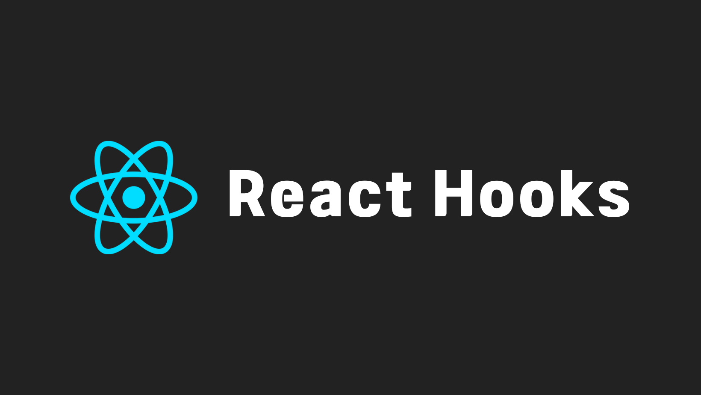

# React Hooks 부수기 🐋

## 🐢 스터디 멤버

|  |  |  |
| :----------------------------------------------------: | :-----------------------------------------------------: | :-------------------------------------------------: |
|          [이승현](https://github.com/hyun812)          |          [이수화](https://github.com/rosielsh)          |          [이원주](https://github.com/3o14)          |

## 🕓 스터디 시간

일시 : 매주 목요일 19:00 ~ 21:00 (유동적)

장소 : 대면

## 📚 스터디 진행방식

- 매주 맡은 hooks md 정리 & 실습 코드 준비
- 각자 발표 후 함께 실습 진행
- 질문이 있다면 자유롭게 Q&A 시간 가지기

## 🚩 스터디 공통 목표

1. 3주 내로 hooks 공부 끝내기
2. 의문이 있다면 넘어가지 않고 해소하기
3. hooks 얼른 끝내고 타입스크립트 스터디 시작하기

## 🗓 스터디 일정

### 1주차 스터디 `2023/07/23`

| 이름   | 주제           |
| ------ | -------------- |
| 이수화 | [useEffect]()  |
| 이승현 | [useContext]() |
| 이원주 | [useState]()   |

## 📍 React hooks

 <b> 공부할 hooks </b>  

<ul>
<li><a href="">useState</a></li>
<li><a href="">useEffect</a></li>
<li><a href="">useContext</a></li>
<li><a href="">useReducer</a></li>
<li><a href="">useMemo</a></li>
<li><a href="">useCallback</a></li>
<li><a href="">useRef</a></li>
<li><a href="">CustomHooks1</a></li>
<li><a href="">CustomHooks1</a></li>
</ul>

