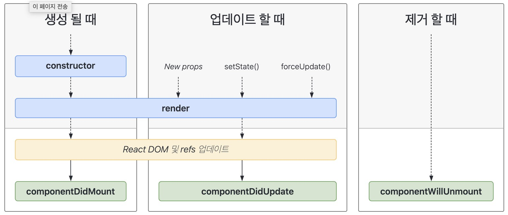
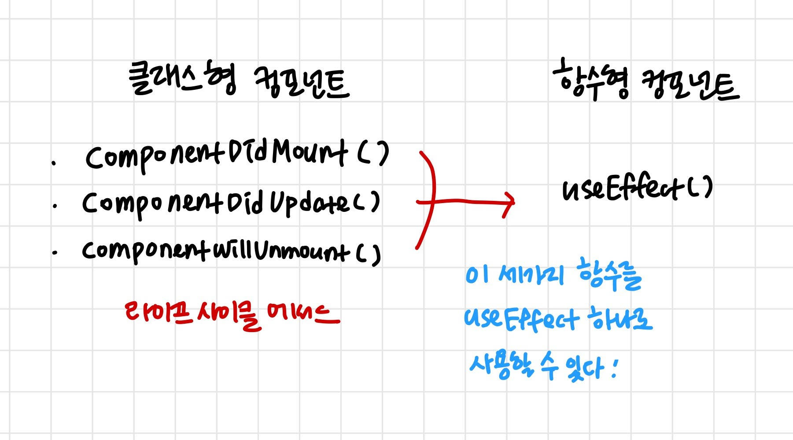

# useEffect

리액트의 `useEffect hook`에 대해서 알기 위해서 우선적으로 이해해야 할 것은 리액트의 `Life Cycle Method` 이다.

### Life Cycle Method



- 컴포넌트는 `(1) 생성 ⇒ (2) 업데이트 ⇒ (3) 제거`의 생명주기를 가진다.
  1. `Mount` (생성)
     - 컴포넌트가 처음 생성되고, 렌더링을 거치는 과정을 의미한다.
     - 이때 진행되는 작업은 state, context 등을 저장하고, componentDidMount와 같은 함수를 호출한다.
  2. `Update` (업데이트)
     - props나 state가 업데이트되고, 리렌더링될 때 발생한다.
     - componentDidUpdate 함수를 실행한다.
  3. `Unmounting` (제거)
     - 화면에서 사라지는 것을 의미한다.
     - unmount와 관련된 라이프사이클 메서드는 `componentWillMount` 메서드가 있다.
       - 주로 DOM에 직접 등록했었던 이벤트를 제거하고, 만약에 setTimeout을 걸은 것이 있다면, clearTimeOut으로 제거를 하는 등의 로직을 작성할 수 있다.

<br/>

### useEffect가 생겨난 배경

이처럼 리액트에는 3가지의 생명주기에 대해 관리하는 메서드들이 존재한다.

하지만 이는 클래스 컴포넌트에서만 사용 가능하며, 함수형 컴포넌트에서는 사용할 수 없다.

따라서 함수형 컴포넌트에서도 이러한 라이프사이클을 대체할 수 있는 구현 방법을 찾게 되었고, 그것이 `useEffect`이다.

<br/>

### useEffect란?

- 클래스형 컴포넌트에서 사용하던 라이프사이클 메서드를 함수형 컴포넌트에서도 사용할 수 있도록 해준 훅이다.



- 예시

<br/>
<aside>
💡 참고로 `클래스형 컴포넌트`와 `함수형 컴포넌트`는 그냥 컴포넌트를 선언하는 두 가지 방식이다.
</aside>
<br/>

- 클래스형 컴포넌트

```jsx
// 컴포넌트가 마운트 될 때
componentDidMount() {
    this.updateList(this.props.id);
}

// id값이 업데이트 될 때
compomentDidUpdate(prevProps) {
    if (prevProps.id === this.props.id) return;
    this.updateList(this.props.id);
}
```

- 함수형 컴포넌트

```jsx
// 렌더링될 때, id가 업데이트 될 때 실행
useEffect(() => {
  updateList(id);
}, [id]);
```

<br/>

### useEffect를 사용하는 방법

useEffect를 사용하는 방법은 크게 3가지로 분류할 수 있다.

```jsx
// 1. 화면에 첫 렌더링 될 때, 다시 렌더링 될 때
useEffect(() => {
  // 원하는 작업
});

// 2. 화면에 첫 렌더링 될 때, value값이 변경될 때
useEffect(() => {
  // 원하는 작업
}, [value]);

// 3. 화면에 첫 렌더링 될 때만 실행
useEffect(() => {
  // 원하는 작업
}, []);
```

<br/>

### 사용 예제

```jsx
import "./App.css";
import { useState, useEffect } from "react"; // useEffect import

function App() {
  const [countA, setCountA] = useState(1);
  const [countB, setCountB] = useState(2);

  const handleCountUpdateA = () => {
    setCountA(countA + 1);
  };

  const handleCountUpdateB = () => {
    setCountB(countB + 1);
  };

  // 렌더링 될 때마다 매번 실행
  useEffect(() => {
    console.log("렌더링 진행");
  });

  // countA가 변경될 때만 실행하고싶은 코드를 작성
  useEffect(() => {
    console.log("A 카운트 변경 !");
  }, [countA]);

  // countB가 변경될 때만 실행하고싶은 코드를 작성
  useEffect(() => {
    console.log("B 카운트 변경 !");
  }, [countB]);

  // 마운트 될 때만 실행하고싶은 코드를 작성
  useEffect(() => {
    console.log("마운팅 ...");
  }, []);

  return (
    <div className="App">
      <div>
        <span>A count : {countA} </span>
        <button onClick={handleCountUpdateA}>Update</button>
      </div>
      <div>
        <span>B count : {countB} </span>
        <button onClick={handleCountUpdateB}>Update</button>
      </div>
    </div>
  );
}

export default App;
```

<br/>

### Clean Up

- Timer

```jsx
import React, { useEffect } from "react";

const Timer = (props) => {
  useEffect(() => {
    // 1초에 한 번 콘솔 출력
    const timer = setInterval(() => {
      console.log("타이머 돌아가는중 ...");
    }, 1000);

    // 타이머를 다 쓰고 정리하는 작업이 필요하다.
    // 타이머가 화면에서 사라질 때 실행된다.
    return () => {
      clearInterval(timer);
      console.log("타이머가 종료되었습니다.");
    };
  }, []);

  return (
    <div>
      <span>타이머 시작 !</span>
    </div>
  );
};

export default Timer;
```

- App

```jsx
import "./App.css";
import { useState } from "react";
import Timer from "./component/Timer";

function App() {
  const [showTimer, setShowTimer] = useState(false);

  return (
    <div className="App">
      <button
        onClick={() => {
          setShowTimer(!showTimer);
        }}
      >
        Toggle Timer
      </button>
      {showTimer && <Timer />}
    </div>
  );
}

export default App;
```

### useEffect 무한 루프

- 다음 코드는 무한 루프를 발생시킨다. 이유를 생각해보자.

```jsx
useEffect(() => {
  setCount(count + 1);
});
```

<details>
<summary>이유</summary>
<div markdown="1">

    useState는 state로 쓰이는 `변수`와, 그 변수를 수정하는 `setter`을 반환하는 hook이다. 그리고 setter을 호출하여 state을 수정하면 `컴포넌트가 다시 렌더링`된다. 그리고 컴포넌트가 렌더링 되면 useEffect 안에 있는 setter가 또다시 호출되고… 그렇게 무한 루프를 발생시키게 된다.

</div>
</details>
<br/>

### 해결 방법

1. 특정 값이 변화되었을 때만 해당 코드가 실행되게 하기

```jsx
import { useEffect, useState } from "react";

function CountInputChanges() {
  const [value, setValue] = useState("");
  const [count, setCount] = useState(-1);

  **useEffect(() => setCount(count + 1), [value]);**

  const onChange = ({ target }) => setValue(target.value);

  return (
    <div>
      <input type="text" value={value} onChange={onChange} />
      <div>Number of changes: {count}</div>
    </div>
  );
}
```

1. useRef를 사용해서 해결하기

```jsx
import { useState, useRef } from "react";

function CountInputChanges() {
  const [value, setValue] = useState("");
  const countRef = useRef(0);

  const onChange = ({ target }) => {
    setValue(target.value);
    countRef.current++;
  };
  return (
    <div>
      <input type="text" value={value} onChange={onChange} />
      <div>Number of changes: {countRef.current}</div>
    </div>
  );
}
```

### 정리

1. useEffect는 클래스 컴포넌트에서만 사용되던 라이프 사이클 메서드를 사용할 수 있게 하는 훅이다.
2. 총 3가지 방식으로 사용할 수 있다.
   1. 두 번째 인자가 없는 형태
   2. 두 번재 인자에 state가 들어간 형태
   3. 두 번째 인자에 빈 배열이 들어간 형태
   - 각각은 특정 상황에서 로직을 처리하고 싶을 때 사용한다.
