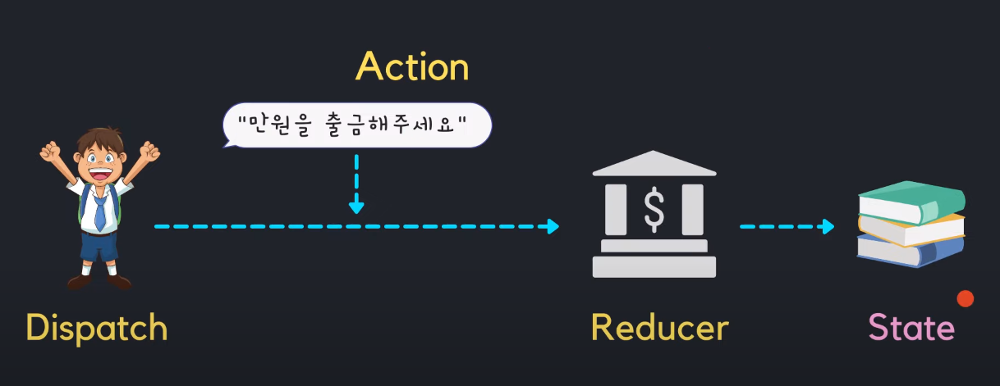
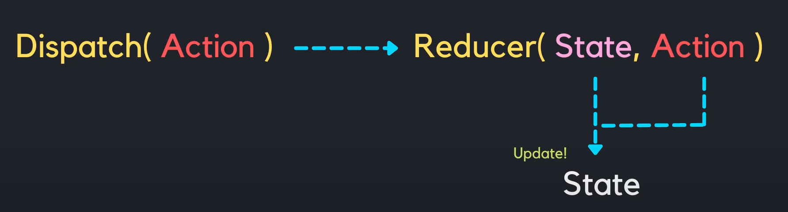

## useReducer란?

useState 처럼 `state를 생성하고 관리할 수 있도록 하는 hook`이다.

> **[공식 문서](https://react-ko.dev/reference/react/useReducer)** > `useReducer` 는 컴포넌트에 [reducer](https://react-ko.dev/learn/extracting-state-logic-into-a-reducer)를 추가할 수 있는 hook입니다.

<br/>

## useReducer은 언제 사용할까?

여러개의 하위값을 포함하는 `복잡한 state`를 다뤄야 할 때 `useReducer`을 사용한다.

ex)

```jsx
{
    teacher: "Kim",
    students: ["Kim", "Lee", "Shin"],
    count: 3,
    locations: [
        {country: 'Korea', name: 'A'},
        {country: 'Japan', name: 'B'}
    ]
}
```

> 가장 중요한 것은 `state를 업데이트하는 로직 부분`을 해당 `컴포넌트로부터 분리`시키는 것을 가능하게 해준다.

<br/>

**useState로 state들을 관리하는 경우**

- 지금은 `컴포넌트 안`에 state 업데이트 로직이 포함되어 있다.

```jsx
import { useState } from 'react';

function Counter() {
    const [number, setNumber] = useState(0);

    **const onDecrease = () => {
        setNumber((prev) => prev - 1);
    }

    const onIncrease = () => {
        setNumber((prev) => prev + 1);
    }**

  return (
    <div>
          <h1>Count : {number}</h1>
          <button onClick={onDecrease}>-</button>
          <button onClick={onIncrease}>+</button>
    </div>
  );
}

export default Counter;
```

<br/>

**useReducer을 활용하여 state들을 관리하는 경우**

- state 업데이트 로직이 `Counter 컴포넌트 밖에 존재`한다.
- 이렇게 `컴포넌트 외부에 state 업데이트 로직을 분리시키는 것이 가능`하고, `파일을 분리하는 것도 가능`하다.

  ```jsx
  import { useReducer, useState } from 'react';

  **function reducer(state, action) {
      switch (action.type) {
          case 'decrement':
              return state - 1;
          case 'increment':
              return state + 1;
          default:
              throw new Error();
      }
  }**

  function Counter() {
      const [number, dispatch] = useReducer(reducer, 0);

    return (
      <div>
            <h1>Count : {number}</h1>
            <button onClick={() => dispatch({ type: 'decrement'})}>-</button>
            <button onClick={() => dispatch({ type: 'increment'})}>+</button>
      </div>
    );
  }

  export default Counter;
  ```

<br/>

**로직을 분리하면 좋은점?**

- 다른 곳에서도 쉽게 `재사용`이 가능하다는 점에서 최적화를 할 수 있다.

<br/>

## useReducer 용어 정리

reducer을 알기 전에 다음 용어들을 알아야 한다.

1. `Dispatch` : reducer에게 action을 요구하는 행위
2. `Action` : reducer에게 요청하는 내용
3. `Reducer` : state를 갱신하는 주체

<br/>

쉽게 설명한 버전



- 사람은 `은행`(**Reducer**)에게 `출금을 해달라고`(**Action**) `요청하고`(**Dispatch**), 은행은 `거래 내역`(**State**)을 갱신한다.

<br/>

컴포넌트 관점



- `Dispatch` 함수의 인자로 `Action`이라는 행동을 넣어서 Reducer에게 전달한다.
- `Reducer`은 우리가 넘겨준 `Action`에 맞게 `state`값을 갱신시킨다.

<br/>

## useReducer 사용법

예제

```jsx
import { useReducer, useState } from 'react';

function **reducer**(state, action) {
    switch (action.type) {
        case 'decrement':
            return state - 1;
        case 'increment':
            return state + 1;
        default:
            throw new Error();
    }
}

function Counter() {
    const [number, **dispatch**] = **useReducer**(reducer, 0); // useReducer 기본 사용법

  return (
    <div>
          <h1>Count : {number}</h1>
          <button onClick={() => **dispatch**({ type: 'decrement'})}>-</button>
          <button onClick={() => dispatch({ type: 'increment'})}>+</button>
    </div>
  );
}

export default Counter;
```

<br/>

1. `useReducer` 함수

   **기본 사용법**

   ```jsx
   const [state, dispatch] = useReducer(reducer, initialState, init);
   ```

   - `state` : 컴포넌트가 사용할 state
   - `dispatch` : reducer 함수를 실행시키며, 컴포넌트 내에서 state의 업데이트를 일으키기 위해 사용하는 함수
   - `reducer` : 컴포넌트 외부에서 state 업데이트 로직을 담당하는 함수
     - 현재 state와 action을 받아서, 업데이트 된 state를 반환
   - `initialState` : 초기 state
   - `init` : 초기 함수

<br/>

2. `action`

   - 업데이트를 위한 정보를 가지고 있는 것이다.
   - 따로 정해진 형태는 없으나, 주로 `type`이라는 `key값`을 지닌 객체 형태로 사용된다.

   **기본 사용법**

   ```jsx
   dispatch(**{ type: "decrement" }**)
   ```

   - 여기서 **`{ type: "decrement" }`** 이 부분이 action 이다.

<br/>

3. `dispatch` 함수

   - reducer 함수를 실행시키는 함수

   **기본 사용법**

   ```jsx
   dispatch({ type: "decrement" });
   ```

<br/>

4. `reducer` 함수

   - dispatch에 의해 실행되는 함수
   - state를 업데이트 하는 함수

   **기본 사용법**

   ```jsx
   function reducer(state, action) {
     switch (action.type) {
       case "decrement":
         // action의 type이 "decrement"일 때, 현재 state에서 1을 뺀 값을 반환함
         return state - 1;
       case "increment":
         // action의 type이 "increment"일 때, 현재 state에서 1을 더한 값을 반환함
         return state + 1;
       default:
         // 정의되지 않은 action type이 넘어왔을 때는 에러를 발생시킴
         throw new Error("Unsupported action type:", action.type);
     }
   }
   ```

<br/>

---

### Q. 다음 코드의 결과를 예측하기

- 기존 `age`는 42

```jsx
function handleClick() {
  console.log(state.age);

  dispatch({ type: "incremented_age" });
  console.log(state.age);

  setTimeout(() => {
    console.log(state.age);
  }, 5000);
}
```

- 결과

  ```jsx
  function handleClick() {
    console.log(state.age); // 42

    dispatch({ type: "incremented_age" }); // Request a re-render with 43
    console.log(state.age); // Still 42!

    setTimeout(() => {
      console.log(state.age); // Also 42!
    }, 5000);
  }
  ```

- 이유

  state가 스냅샷처럼 동작한다.
  state 상태를 업데이트하면 새 상태값으로 요청되지만, 이미 실행 중인 이벤트 핸들러의 Javascript 변수에는 영향을 미치지 않는다.

- 해결

  직접 reducer을 호출하고 변수에 담음으로서 해결할 수 있다.

  ```jsx
  const action = { type: "incremented_age" };
  dispatch(action);

  const nextState = reducer(state, action);
  console.log(state); // { age: 42 }
  console.log(nextState); // { age: 43 }
  ```

---

<br/>

**출처**

[https://velog.io/@iamhayoung/React-Hooks-useReducer에-대해-알아보기](https://velog.io/@iamhayoung/React-Hooks-useReducer%EC%97%90-%EB%8C%80%ED%95%B4-%EC%95%8C%EC%95%84%EB%B3%B4%EA%B8%B0)

https://ko.legacy.reactjs.org/docs/hooks-reference.html#usereducer

https://react.dev/reference/react/useReducer#adding-a-reducer-to-a-component
