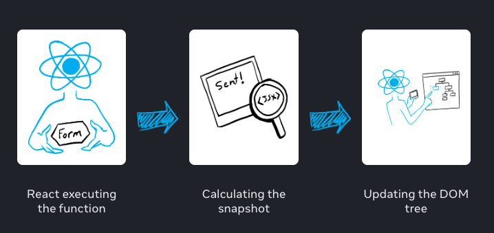

# State as a Snapshot

state와 rendering 사이의 관계를 자세히 살펴보자.

### 렌더링은 스냅샷을 찍는다.

`Rendering` 은 리액트가 컴포넌트를 호출하는 것을 의미한다.

리액트가 컴포넌트를 re-render할 때

1. 리액트는 함수를 다시 호출한다.
2. 함수는 새로운 JSX 스냅샷을 리턴한다.
3. 리액트는 리턴받은 스냅샷으로 화면을 update한다.

